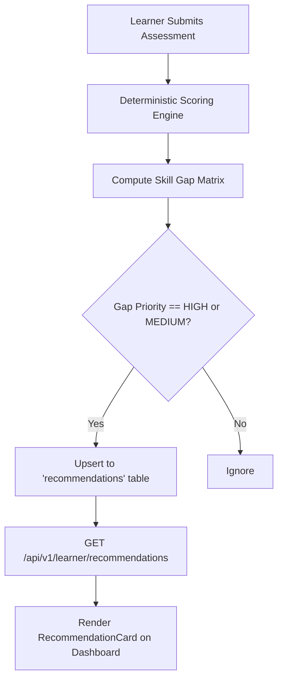

# VYREN Project — Technical Consultation Report: Real iGOT Karmayogi Data Strategy

**Role:** Senior Technical Consultant  
**Session Mode:** STRICT READ-ONLY INSPECTION & CONSULTATION  
**Codebase State Verified:** September 13, 2026  

---

## Executive Summary of Findings

| Investigation Dimension | Codebase Reality | Status Taxonomy | Exact Code / Data Location |
| :--- | :--- | :--- | :--- |
| **Active iGOT Provider** | `LocalFallbackIgotProvider` (active due to absent credentials) | `IMPLEMENTED` & `FALLBACK` | `backend/app/services/igot_client.py:217-306` |
| **Real Provider Interface** | `RealIgotProvider` (HTTP client with Bearer auth & endpoints) | `INTEGRATION-READY` | `backend/app/services/igot_client.py:83-215` |
| **Current Course Catalog Data** | Exactly **1 mock course** (`Data Pipeline Design: Enterprise Patterns`) with 3 modules | `MOCKED` / `FALLBACK` | Supabase table `courses` & `supabase/migrations/004_seed_data.sql:145-192` |
| **Frontend Learning Path** | 3 static mock cards hardcoded in JSX | `MOCKED` | `src/components/learning/LearningPathTimeline.tsx:6-37` |
| **Course Catalog Storage** | PostgreSQL tables `courses` & `course_modules` in Supabase | `IMPLEMENTED` | `supabase/migrations/001_create_tables.sql:180-230` |
| **Scraper / Harvester Scripts** | **Zero scripts exist** in the repository | **NOT IMPLEMENTED** | Verified across all workspace files |
| **Public iGOT Portal API Calls** | **Zero live calls** to `igotkarmayogi.gov.in` | **NOT IMPLEMENTED** | Backend / Frontend code inspection |
| **FRAC Competency Mappings** | 4 core competencies mapped to official FRAC codes | `IMPLEMENTED` & `FALLBACK` | `backend/app/services/igot_client.py:23-56` |
| **W3C Verifiable Passport** | Live translation of deterministic test scores into FRAC claims | `IMPLEMENTED` | `backend/app/services/igot_client.py:249-290` |

---

## 1. Where Does iGOT Data Currently Come From?

In the running system, iGOT data originates from **two internal sources**:

1. **In-Memory FRAC Definitions:**  
   Located in `backend/app/services/igot_client.py:23-56`.  
   It maps VYREN's 4 core competencies to Framework for Roles, Activities and Competencies (FRAC) standards:
   - Statistical Inference $\rightarrow$ `FRAC-DA-STAT-01` (*Analytical Thinking & Quantitative Evaluation*)
   - Data Pipeline Design $\rightarrow$ `FRAC-DE-PIPE-02` (*Digital Infrastructure & Systems Engineering*)
   - Machine Learning Ops $\rightarrow$ `FRAC-AI-MLOPS-03` (*Emerging Technologies & AI Adoption*)
   - Data Governance $\rightarrow$ `FRAC-DM-GOV-04` (*Policy Adherence, Security & Public Data Ethics*)

2. **Supabase PostgreSQL Database:**  
   The factory function `get_igot_provider()` checks `.env` for `IGOT_API_URL` and `IGOT_AUTH_TOKEN`. Because these are omitted, it instantiates `LocalFallbackIgotProvider`. When `get_courses()` is called, it queries `CourseRepository.list_courses()`, retrieving rows directly from the local Supabase `courses` table.

---

## 2. Is the Current Dataset Real iGOT Data or Mock Data?

> [!IMPORTANT]
> **Finding:** The current dataset is **100% Mock / Seed Data**. There is currently no real course metadata imported from iGOT Karmayogi in either the database or frontend.

### Evidence:
1. **Database Audit:**  
   Running a query against the Supabase `courses` table yields:
   ```json
   Total courses in DB: 1
   {
     "id": "b0100000-0000-0000-0000-000000000001",
     "title": "Data Pipeline Design: Enterprise Patterns",
     "category": "Data Engineering",
     "competencies_covered": ["c1000000-0000-0000-0000-000000000002"],
     "is_active": true
   }
   ```
   This single course originates directly from the initial migration file `supabase/migrations/004_seed_data.sql:145-192`.

2. **Frontend Audit:**  
   In `src/components/learning/LearningPathTimeline.tsx:6-37`, the timeline renders static array items hardcoded into the component:
   - `step-1`: *Initial Competency Diagnostic*
   - `step-2`: *Advanced Machine Learning Systems Engineering*
   - `step-3`: *Post-Module Capability Evaluation*

---

## 3. Where is the Catalog Stored and How are Courses Represented?

### A. Database Storage Schema
Courses and their curriculum modules are stored in Supabase PostgreSQL:

1. **`courses` table:**  
   Defined in `supabase/migrations/001_create_tables.sql`:
   - `id`: UUID (Primary Key)
   - `title`: TEXT
   - `description`: TEXT
   - `category`: TEXT
   - `level`: INTEGER (1 to 4)
   - `duration_minutes`: INTEGER
   - `competencies_covered`: UUID[] (Array of `competencies.id` foreign keys)
   - `is_active`: BOOLEAN
   - `created_at`: TIMESTAMP WITH TIME ZONE

2. **`course_modules` table:**  
   - `id`: UUID (Primary Key)
   - `course_id`: UUID (Foreign Key $\rightarrow$ `courses.id`)
   - `competency_id`: UUID (Foreign Key $\rightarrow$ `competencies.id`, used for score recalibration)
   - `title`: TEXT
   - `type`: TEXT (`reading`, `code_exercise`, `quiz`)
   - `content`: TEXT (Markdown instructional content)
   - `order_index`: INTEGER
   - `duration_minutes`: INTEGER

3. **`course_enrollments` table:**  
   Tracks learner progress:
   - `id`: UUID
   - `user_id`: UUID
   - `course_id`: UUID
   - `progress_percentage`: NUMERIC
   - `completed_modules`: JSONB / UUID[]
   - `status`: TEXT (`enrolled`, `in_progress`, `completed`)
   - `enrolled_at`, `completed_at`: TIMESTAMP WITH TIME ZONE

### B. API Representation Schemas
In `backend/app/schemas/igot.py:56-64`, courses exposed via `/api/v1/igot/courses` are formatted as:
```python
class IgotCourseItem(BaseModel):
    id: str
    title: str
    provider: str
    competency_area: str
    duration: str
    integration_mode: str = "FALLBACK / LOCAL"
    external_url: Optional[str] = None
```

---

## 4. How Course IDs, Metadata, and Competency Linkages are Handled

- **ID Scheme:**  
  VYREN currently uses **fixed hex-only UUIDs** (e.g. `b0100000-0000-0000-0000-000000000001`).
- **ID Normalization Fallback:**  
  `CourseRepository._normalize_id()` traps non-UUID strings (like `crs-001` or truncated IDs) and safely remaps them to `b0100000-0000-0000-0000-000000000001` to prevent database exceptions.
- **Competency Linkage:**  
  Linkage is established via the `competencies_covered` array column in `courses` and the `competency_id` column in `course_modules`.
- **Deterministic Recalibration on Completion:**  
  When `CourseRepository.complete_module()` is called, it inspects `target_module.competency_id`, increments the user's competency score by $+25.0$ points (capped at $88.0$), recalculates the measured level ($0$–$4$), and invokes `GapEngine.compute_gap()` to immediately update `skill_gaps` priority.

---

## 5. How Recommendations Consume This Data

The recommendation pipeline currently operates as follows:



1. **Trigger Point:**  
   In `backend/app/repositories/assessment_repo.py:134-148`, after assessment scoring, for any competency gap with priority `HIGH` or `MEDIUM`, an advisory record is upserted:
   ```python
   {
       "user_id": user_id,
       "competency_id": gap["competency_id"],
       "title": f"Targeted Learning: {gap['competency_name']}",
       "description": f"Priority {gap['priority']} skill gap detected. Improve from Level {gap['current_level']} to Level {gap['required_level']}.",
       "priority": gap["priority"],
       "type": "course",
       "is_dismissed": False
   }
   ```
2. **Current Limitation:**  
   The `recommendations` table stores an advisory record containing `competency_id` and text descriptions, but **does not yet link directly to a specific `course_id` row** from the `courses` table.  
   The frontend timeline (`LearningPathTimeline.tsx`) is static and not yet wired to dynamically render from the `recommendations` or `courses` tables.

---

## 6. Do Scrapers, Crawlers, Public Endpoints, or Extractors Exist?

A search across the entire project repository (`*.py`, `*.ts`, `*.tsx`, `*.sql`, `*.sh`, `*.ps1`) confirms:

| Mechanism | Exists in Current Codebase? | Details |
| :--- | :---: | :--- |
| **Web Scrapers / Crawlers** | **NO** | No BeautifulSoup, Playwright, Scrapy, Selenium, Puppeteer, or regex HTML parsing scripts exist. |
| **Harvesting / Extraction Scripts** | **NO** | No script exists to pull or ingest course catalogs from `igotkarmayogi.gov.in`. |
| **Public Unauthenticated Endpoint Calls** | **NO** | Neither backend nor frontend queries Sunbird public search endpoints (`/api/content/v1/search`). |
| **Static / Scraped Seed Files** | **NO** | No external JSON/CSV dumps of iGOT courses exist in the project tree. |

---

## 7. Precise Taxonomy Breakdown: Implemented vs. Planned vs. Mocked

To provide clear visibility:

### A. IMPLEMENTED (Working & Verified in Codebase)
- **iGOT Provider Architecture & Factory:** `backend/app/services/igot_client.py` (`BaseIgotProvider`, `RealIgotProvider`, `LocalFallbackIgotProvider`).
- **Honest Mode Transparency API:** `GET /api/v1/igot/status` reporting exact blocker diagnostics (`"Official iGOT Karmayogi authenticated API credentials not configured in environment"`).
- **Competency Passport Export:** `GET /api/v1/igot/passport` translating actual user assessment scores into W3C Verifiable Credential format (`W3C-VC-Karmayogi-FRAC-1.0`) with level descriptors ($0$ to $4$).
- **Bidirectional FRAC Mapping Table:** `GET /api/v1/igot/frac-mapping` with 4 core competency definitions.
- **Local Course Management API:** Full CRUD/Lifecycle in `GET /api/v1/courses`, `GET /api/v1/courses/{id}`, `POST /api/v1/courses/{id}/enroll`, `POST /api/v1/courses/{id}/modules/{id}/complete`.
- **Score Recalibration Engine:** Module completion recalibrating user competency score ($+25$ points), level, and gap priority in Supabase.
- **Frontend Passport UI & Dossier:** `ProfilePage.tsx` rendering the Karmayogi Passport, mode badge, raw JSON-LD inspector, `.json` file exporter, and MoSPI-aligned Competency Dossier modal.

### B. INTEGRATION-READY (Architecture Built; Awaiting External Credentials)
- **`RealIgotProvider`:** Equipped with HTTP client methods for `/health`, `/api/v1/frac/competencies`, `/api/v1/credentials/issue`, and `/api/v1/courses` with Bearer token authentication.

### C. MOCKED / FALLBACK (Simulated or Placeholder Data Active)
- **Course Catalog Data:** Single seeded mock course (`Data Pipeline Design: Enterprise Patterns`) in Supabase.
- **Learning Path Timeline UI:** 3 static steps hardcoded in `LearningPathTimeline.tsx`.
- **FRAC Taxonomy Definitions:** 4 hardcoded dictionaries in `FRAC_DEFINITIONS` within `igot_client.py`.

### D. PLANNED (Documented in Roadmap but NOT Yet in Codebase)
- **Real iGOT Course Catalog Ingestion:** Curating real public portal courses from `igotkarmayogi.gov.in` (e.g. Statistical System courses, National Accounts, MoSPI digital modules).
- **Public Sunbird Portal Search Adapter:** Calling unauthenticated Sunbird search APIs on Karmayogi to retrieve live search results without enterprise credentials.
- **Dynamic Course Recommendation Mapping:** Binding detected skill gaps directly to specific course IDs in the database.
- **Dynamic Timeline Rendering:** Replacing static timeline steps with rows fetched from `courses` and `course_enrollments`.

---

## 8. Concrete Strategy: How to Obtain and Ingest a Real iGOT Dataset

To expand beyond the single mock course and populate VYREN with **genuine iGOT Karmayogi course metadata** without compromising deterministic rules or faking official API connectivity, there are **three viable technical pathways**:

### Comparison of Pathways

| Criteria | Pathway A: Curated Public Ingestion (Recommended) | Pathway B: Public Sunbird Gateway Adapter | Pathway C: Official DoPT/CBC Gateway |
| :--- | :--- | :--- | :--- |
| **Description** | Extract real course titles, descriptions, IDs, and URLs from public iGOT portal; normalize to VYREN schema; seed into Supabase. | Backend queries public Sunbird search endpoint (`/api/content/v1/search`) in real time. | Connect via official DoPT/CBC mTLS certificates or enterprise OAuth2 credentials. |
| **External Dependency** | None at runtime (offline dataset curation). | Depends on unauthenticated public portal API availability and CORS/rate limits. | Requires formal government MoU / CBC approval. |
| **Feasibility for SIH / Demo** | **Immediate & 100% Reliable** (guaranteed offline stability). | Medium (risk of portal downtime or API schema shifts during presentation). | Blocked (credentials not publicly available). |
| **Deterministic Compatibility** | 100% — Courses have fixed IDs, explicit competency tags, and structured modules. | Moderate — Live search returns variable results that require dynamic alignment. | 100% — Official standard. |
| **Mode Transparency** | Honestly flagged as `REAL CATALOG (PUBLIC METADATA) / LOCAL RUNTIME`. | Flagged as `REAL (PUBLIC ENDPOINT)`. | Flagged as `REAL (OFFICIAL AUTHENTICATED)`. |

---

## 9. Recommended Next Action Plan (For Your Decision)

When you are ready to transition from consultation mode into execution, the optimal sequential approach is:

1. **Curate Real iGOT Course Metadata:**
   Collect 8–12 real, publicly available MoSPI & Civil Service training courses directly from `igotkarmayogi.gov.in` (e.g., *Official Statistics & National Accounts*, *Survey Design and Sampling Techniques*, *Data Quality Frameworks*, *Cybersecurity in Governance*, *Advanced Python for Data Analytics*).

2. **Structure Course Schema with Genuine Metadata:**
   Preserve real iGOT course titles, real providers (e.g., *National Statistical Systems Training Academy (NSSTA)*, *ISTM*, *DoPT*), real durations, and direct links to the public iGOT portal (`https://igotkarmayogi.gov.in/app/toc/...`).

3. **Map Each Course to Existing Competency UUIDs:**
   Tag each real course with the exact `competency_id` foreign keys matching VYREN's 4 core domains (`c1000000-0000-0000-0000-000000000001` through `...0004`).

4. **Dynamic Recommendation Binding:**
   Update `assessment_repo.py` and `recommendationService.ts` so that when a gap is detected in e.g. `Statistical Inference`, the system recommends the specific real NSSTA/iGOT course assigned to that competency.

5. **Dynamic Timeline:**
   Update `LearningPathTimeline.tsx` to read dynamic course enrollments and recommendation objects rather than static JSX.

---

*This document was generated strictly from the current verified codebase.*
