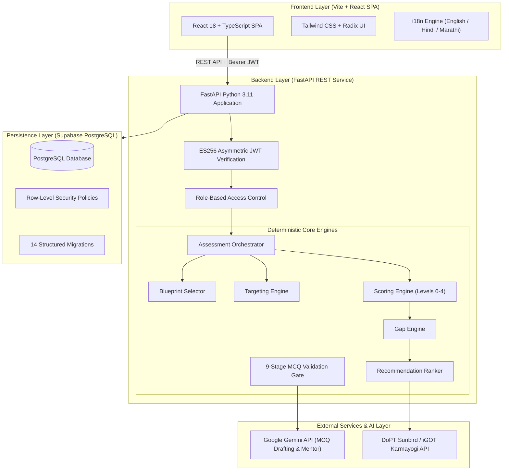

# VYREN
### Competency Intelligence Platform
> *"Turn Skills Into Intelligence."*

---

[](https://sih.gov.in)
[](https://mospi.gov.in)
[](https://nssta.gov.in)
[](https://karmayogibharat.gov.in)
[](#17-security--access-control)

[-brightgreen?style=flat-square&logo=pytest&logoColor=white)](#22-testing--validation)
[](#9-technology-stack)
[](#9-technology-stack)
[](#9-technology-stack)
[](#11-ai--deterministic-intelligence)
[](#4-key-capabilities)

---

## Table of Contents

<div align="center">

<a href="#1-overview">Overview</a> •
<a href="#2-problem-statement">Problem Statement</a> •
<a href="#3-solution">Solution</a> •
<a href="#4-key-capabilities">Key Capabilities</a> •
<a href="#5-how-vyren-works">How VYREN Works</a>

<br/>

<a href="#6-core-intelligence-pipeline">Core Intelligence Pipeline</a> •
<a href="#7-user-roles">User Roles</a> •
<a href="#8-technical-architecture">Technical Architecture</a> •
<a href="#9-technology-stack">Technology Stack</a>

<br/>

<a href="#10-igot-karmayogi-integration">iGOT Karmayogi Integration</a> •
<a href="#11-ai--deterministic-intelligence">AI + Deterministic Intelligence</a> •
<a href="#12-personalized-diagnostic">Personalized Diagnostic</a> •
<a href="#13-recommendation-engine">Recommendation Engine</a>

<br/>

<a href="#14-document-intelligence--grounded-context">Document Intelligence & Grounded Context</a> •
<a href="#15-ai-generated-mcqs--validation-pipeline">AI-Generated MCQs & Validation Pipeline</a> •
<a href="#16-adaptive-learning-loop">Adaptive Learning Loop</a> •
<a href="#17-security--access-control">Security & Access Control</a>

<br/>

<a href="#18-project-structure">Project Structure</a> •
<a href="#19-setup--installation">Setup & Installation</a> •
<a href="#20-environment-variables">Environment Variables</a> •
<a href="#21-running-the-application">Running the Application</a> •
<a href="#22-testing--validation">Testing & Validation</a>

<br/>

<a href="#23-demo-flow">Demo Flow</a> •
<a href="#24-future-scope">Future Scope</a> •
<a href="#25-team--tech-strikers">Team — Tech Strikers</a> •
<a href="#26-sih-2026--institutional-alignment">SIH 2026 & Institutional Alignment</a>

</div>

---

## 1. Overview

**VYREN** is an institutional Competency Intelligence Platform architected for the **Official Statistical System (OSS)** of India under the **Ministry of Statistics and Programme Implementation (MoSPI)**, aligned with the **National Statistical Systems Training Academy (NSSTA)** and the **Capacity Building Commission (CBC)** under **Mission Karmayogi**.

### Paradigm Shift: LMS vs. Competency Intelligence Platform

VYREN is **not** a traditional Learning Management System (LMS). Traditional LMS platforms manage courses, record video watch duration, and track elective enrollments. VYREN treats competency as an empirical, verifiable, and continuously updated institutional asset.

| Dimension | Conventional LMS (e.g., Course Catalogs) | VYREN Competency Intelligence Platform |
| :--- | :--- | :--- |
| **Primary Metric** | Completion certificates, hours logged, video clicks | Empirical measured proficiency (Levels 0–4) and verified gap deltas |
| **Diagnostic Intake** | Self-reported survey checkboxes or static questionnaires | **18-item context-targeted diagnostic** with deterministic blueprinting |
| **Scoring Model** | Arbitrary percentages without epistemic certainty | **Deterministic scoring** separated strictly from independent **Evidence Confidence** |
| **Recommendations** | Static elective catalogs or generic tag matching | **Explainable ranking** pairing quantified gaps with live Sunbird/iGOT modules |
| **Post-Learning Impact** | Static certificates with zero reassessment | **Adaptive closed loop** recalculating competency state upon empirical evidence |
| **Workforce Governance**| Aggregate vanity completion rates | **Readiness landscapes**, cadre capability heatmaps, and auditable evidence logs |

---

## 2. Problem Statement

National statistical operations and civil service capacity development face three structural bottlenecks:

1. **Speculative Course Enrollment:** Officers are assigned blanket training programs without prior diagnostic intake calibrated to their specific cadre wing (e.g., Indian Statistical Service vs. Subordinate Statistical Service vs. State Directorates of Economics & Statistics).
2. **Unverified Capability Growth:** Course attendance certificates are treated as proxies for capability growth without psychometrically sound pre- and post-intervention evaluations.
3. **Institutional Capability Blind Spots:** Leadership and academy directors lack real-time workforce readiness telemetry, making it difficult to pinpoint whether critical departments have sufficient mastery in survey sampling, MLOps, or data governance.

---

## 3. Solution

VYREN eliminates these bottlenecks through a **closed-loop competency lifecycle**:

```
Profile / Context
    ↓
Personalized Diagnostic
    ↓
Deterministic Competency Scoring
    ↓
Confidence + Evidence
    ↓
Skill Gap Detection
    ↓
Explainable Recommendation Ranking
    ↓
Dynamic iGOT / Local Course Resolution
    ↓
Personalized Learning
    ↓
Learning Evidence
    ↓
Adaptive Reassessment
    ↓
Updated Competency State
    ↓
Updated Recommendations
```

1. **Contextual Intake:** Ingests officer cadre, operational focus, tools, and responsibilities.
2. **Targeted Assessment:** Generates an 18-question diagnostic intake tailored to the officer's administrative context.
3. **Deterministic Evaluation:** Classifies performance into discrete Levels 0–4 with independent Evidence Confidence ($C_c \in [0, 1]$).
4. **Quantified Skill Gaps:** Computes capability deficits relative to mandatory cadre benchmarks ($\Delta_c = \max(0, B_c - S_c)$).
5. **Tiered Course Resolution:** Queries DoPT Sunbird/iGOT Karmayogi course endpoints using multi-tiered search, normalizes metadata, and provisions canonical launch URLs.
6. **Empirical Recalibration:** Reassesses competency post-learning, closes resolved gaps, and dynamically updates recommendations.

---

## 4. Key Capabilities

* **Cadre-Aware Onboarding:** Ingests designation, cadre wing (ISS, SSS, State DES), division, tools, and self-reported experience.
* **18-Item Dynamic Blueprint Diagnostic:** Synthesizes slot-based assessments covering 4 core statistical framework domains.
* **Deterministic Scoring Engine:** Mathematical evaluation guaranteeing identical inputs produce identical scores, independent of LLM variance.
* **Discrete Levels & Evidence Confidence:** Explicit separation between measured proficiency (Levels 0–4) and evidence confidence ($0.00$ to $1.00$).
* **Tiered Sunbird / iGOT Integration:** Tier 1 contextual search $\rightarrow$ Tier 2 competency-only fallback $\rightarrow$ Tier 3 local catalog fallback with dynamic course normalization and upsert.
* **Explainable Recommendation Ranker:** Ranks skill gaps based on priority tier, gap size, evidence confidence, and contextual relevance.
* **Adaptive Reassessment Loop:** Re-evaluates competency post-learning; eliminates resolved gaps and celebrates cadre baseline achievement.
* **AI Question Authoring Studio with 9-Stage QC Gate:** Enables faculty to draft candidate questions passing 9 automated pedagogical validation gates.
* **Macro Workforce Governance:** Interactive capability landscapes, cadre readiness distributions, and one-click CSV audit exports for administrators.
* **100% Multilingual Parity:** Seamless, reload-free localization across **English**, **हिन्दी (Hindi)**, and **मराठी (Marathi)** with 462 translation keys per locale.

---

## 5. How VYREN Works

```mermaid
flowchart TD
    subgraph S1 ["1. Context & Intake"]
        A1["Officer Profile Context"] --> A2["Cadre Wing (ISS / SSS / State)"]
        A2 --> A3["Operational Tools & Responsibilities"]
    end

    subgraph S2 ["2. Blueprint Formulation"]
        A3 --> B1["Blueprint Selector"]
        B1 --> B2["18-Item Blueprint Grid (4 Domains, Bloom Levels)"]
    end

    subgraph S3 ["3. Assessment Delivery"]
        B2 --> C1["Personalized 18-Question Diagnostic"]
        C1 --> C2["Server-Side Evaluation (Zero Key Exposure)"]
    end

    subgraph S4 ["4. Deterministic Scoring"]
        C2 --> D1["Deterministic Scoring Engine"]
        D1 --> D2["Discrete Level 0 to 4 Classification"]
        D1 --> D3["Independent Evidence Confidence (0.0 to 1.0)"]
    end

    subgraph S5 ["5. Gap Analysis & Ranking"]
        D2 --> E1["Skill Gap Quantification (Delta = Benchmark - Measured)"]
        E1 --> E2["Recommendation Ranker (Gap Size, Priority, Confidence)"]
    end

    subgraph S6 ["6. Tiered iGOT Resolution"]
        E2 --> F1{"Tiered Sunbird Search"}
        F1 -- "Tier 1: Contextual" --> F2["Targeted Query"]
        F1 -- "Tier 2: Competency Fallback" --> F3["Clean Competency Query"]
        F1 -- "Tier 3: Local Failsafe" --> F4["Curated Catalog"]
        F2 & F3 & F4 --> F5["Course Normalization & Upsert (UUIDv5)"]
    end

    subgraph S7 ["7. Adaptive Learning Loop"]
        F5 --> G1["Canonical iGOT Course Launch"]
        G1 --> G2["Learning Evidence Logged"]
        G2 --> G3["Adaptive Post-Learning Reassessment"]
        G3 --> G4{"Cadre Benchmark Met?"}
        G4 -- "Gaps Persist" --> E1
        G4 -- "Baseline Achieved" --> G5["All Cadre Domains Met (No Gaps)"]
    end

    style S1 fill:#1e293b,stroke:#64748b,stroke-width:1px
    style S2 fill:#1e293b,stroke:#3b82f6,stroke-width:1px
    style S3 fill:#1e293b,stroke:#8b5cf6,stroke-width:1px
    style S4 fill:#1e293b,stroke:#10b981,stroke-width:1px
    style S5 fill:#1e293b,stroke:#f59e0b,stroke-width:1px
    style S6 fill:#1e293b,stroke:#06b6d4,stroke-width:1px
    style S7 fill:#1e293b,stroke:#ec4899,stroke-width:1px
```



---

## 6. Core Intelligence Pipeline

### The Foundational Distinction

> **"Context personalizes the diagnostic. Performance determines the measured competency."**

Onboarding responses (role, responsibilities, tools, self-reported experience) select and contextualize the diagnostic items. However, onboarding input **never directly modifies** or inflates the learner's measured competency score.

### Key Evaluation Concepts

1. **Deterministic Competency Score ($S_c \in [0, 100]$):**
   Calculated from evaluated item responses $y_i \in \{0, 1\}$ and item weights $w_i > 0$:
   $$S_c = \frac{\sum_{i=1}^{n_c} w_i \cdot y_i}{\sum_{i=1}^{n_c} w_i} \times 100$$

2. **Discrete Proficiency Levels (0 to 4):**
   * **Level 0 (0%–24%):** Foundational — Rudimentary conceptual familiarity.
   * **Level 1 (25%–49%):** Working — Executes routine procedures under ongoing guidance.
   * **Level 2 (50%–69%):** Autonomous — Independently designs sampling frames and pipelines.
   * **Level 3 (70%–84%):** **Proficient (Cadre Benchmark)** — Solves complex anomalies, ensures regulatory compliance.
   * **Level 4 (85%–100%):** Master — Architects national statistical methodologies, leads data governance audits.

3. **Independent Evidence Confidence ($C_c \in [0.00, 1.00]$):**
   Measures sample completeness and response consistency:
   $$C_c = \min\left(1.0,\, \frac{n_c}{N_{\text{req}}}\right) \times \left(1.0 - \frac{\sigma_c}{2}\right)$$
   *Confidence never modifies the score.* An officer answering a single item correctly receives a high score with low confidence ($\approx 0.25$), triggering additional verification items in future checks.

4. **Empirical Skill Gap ($\Delta_c$):**
   Calculated relative to the cadre benchmark $B_c$ (Level 3 = 70%):
   $$\Delta_c = \max\left(0,\, B_c - S_c\right)$$
   * Priority `HIGH`: Gap size $\ge 2$ levels.
   * Priority `MEDIUM`: Gap size $= 1$ level.
   * Priority `NONE`: Gap size $= 0$ (competency benchmark achieved).

---

## 7. User Roles

VYREN enforces server-side Role-Based Access Control (RBAC) across three distinct roles:

### 1. 🎓 Learner (`learner`)
* Complete 5-step contextual onboarding (Cadre Wing, Designation, Responsibilities, Tools, Goals).
* Complete 18-question personalized baseline diagnostic.
* Review interactive competency radars and gap breakdowns.
* Receive explainable recommendations linking deficits to iGOT modules.
* Launch canonical iGOT courses and log learning evidence.
* Complete adaptive reassessments to close skill gaps.
* Consult the grounded AI Assistant for statistical mentorship.

### 2. 👨‍🏫 Trainer / Faculty (`trainer`)
* AI Question Authoring Studio with automated 9-stage pedagogical quality inspector.
* Assessment item bank management (`validated`, `provisional`, `deprecated` statuses).
* Cohort competency distribution analytics across Levels 0–4.
* Longitudinal pre/post intervention tracking.

### 3. 🏛️ Administrator (`admin`)
* Workforce capability landscape across national directorates and academies.
* Cadre wing readiness breakdown (ISS vs. SSS vs. State DES).
* Real-time system telemetry (PostgreSQL connection, JWT cryptography, Sunbird API health).
* One-click CSV export of workforce competency matrices for official audits.

---

## 8. Technical Architecture



---

## 9. Technology Stack

| Layer | Technologies | Responsibilities |
| :--- | :--- | :--- |
| **Frontend** | React 18, TypeScript, Vite, Tailwind CSS, Radix UI, Lucide Icons | High-performance SPA, WCAG 2.1 AA accessible UI, radar charts, timer controls, 100% i18n parity |
| **Backend** | Python 3.11, FastAPI, Uvicorn, Pydantic v2, HTTPX | Asynchronous REST API, deterministic scoring pipelines, background pre-generation, concurrency registry |
| **Database** | Supabase PostgreSQL, `pgvector`, Connection Pooling | Relational integrity, Row-Level Security, atomic transactions, 14 forward-only migrations |
| **AI Layer** | Google Gemini API (REST) | Candidate question drafting, pedagogical rationales, conversational competency assistant |
| **Auth & Security**| ES256 Asymmetric JWT, PyJWT, bcrypt, RBAC | Cryptographic token signing, role-based endpoint protection, strict IDOR isolation, dual-identity demo gates |
| **External Integration** | DoPT Sunbird iGOT APIs (`igotkarmayogi.gov.in`) | Live public course catalog search, metadata normalization, canonical course URLs |

---

## 10. iGOT Karmayogi Integration

VYREN connects diagnostic evaluations to the **DoPT iGOT Karmayogi Sunbird API**:

### Integration Architecture
* **Public Discovery API:** Communicates with Sunbird Content Search (`POST /api/content/v1/search`) and Course Hierarchy (`GET /api/course/v1/hierarchy/{courseId}`).
* **Generic Tiered Course Resolution:**
  1. **Tier 1 (Contextual Query):** Enriched search query combining competency name, officer designation, and analytical tools.
  2. **Tier 2 (Competency-Only Fallback Query):** Clean competency title query executed if Tier 1 yields zero results due to restrictive catalog tags.
  3. **Tier 3 (Local Catalog Fallback):** Curated local statistical module failsafe activated if external networks or gateways are unreachable.
* **Deterministic Course Normalization & Upsert:**
  * Generates deterministic UUIDv5 identifiers from Sunbird `DO_ID` values (`uuid.uuid5(NAMESPACE_DNS, f"igot:{do_id}")`).
  * Normalizes duration, provider, description, and mapped competencies.
  * Dynamically upserts courses into `public.courses` with `external_id`, `provider`, and canonical launch URLs:
    `https://portal.igotkarmayogi.gov.in/public/toc/{do_id}/overview`.
* **Governance Boundary:** Operates strictly within public course discovery and external URL redirection. VYREN does not claim unauthorized writeback access to government learner profiles.

---

## 11. AI + Deterministic Intelligence

VYREN maintains an architectural boundary between generative AI and deterministic evaluation:

| Function | Responsible Subsystem | Implementation Mechanism |
| :--- | :--- | :--- |
| **Candidate Question Drafting** | AI Layer (Gemini API) | Generates candidate prompt stems, 4 distractors, and pedagogical rationales |
| **Question Quality Assurance** | Deterministic Engine | Automated 9-stage validation gate inspecting options, answer keys, length, and tone |
| **Competency Scoring** | Deterministic Engine | Mathematical weighted evaluation ($S_c$) executing against server-side snapshots |
| **Proficiency Classification** | Deterministic Engine | Discrete threshold mapping into Levels 0 through 4 |
| **Evidence Confidence** | Deterministic Engine | Independent formula ($C_c$) measuring sample density and variance |
| **Skill Gap Quantification** | Deterministic Engine | Exact difference calculation ($\Delta_c = \max(0, B_c - S_c)$) |
| **Recommendation Ranking** | Deterministic Engine | Multi-signal priority sort (Priority tier $\rightarrow$ Gap size $\rightarrow$ Confidence $\rightarrow$ Context) |
| **Competency Mentoring** | AI Layer (Gemini API) | Conversational assistant injected with the learner's measured dossier memory |

> [!IMPORTANT]
> **LLMs never compute, adjust, or assign competency scores.** All scoring, level classifications, and gap calculations are strictly executed by deterministic Python algorithms.

---

## 12. Personalized Diagnostic

* **Dynamic Blueprint Generation:** Based on onboarding profile data, selects 18 structured item slots covering 4 statistical framework domains at calibrated Bloom cognitive levels.
* **Asynchronous Pre-Generation Worker:** Upon onboarding submission, FastAPI enqueues background synthesis of the 18 items, ensuring the learner experiences zero cold-start latency when clicking "Start Assessment".
* **In-Flight Concurrency Registry (`_IN_FLIGHT_GENERATIONS`):** If a learner opens the assessment before background generation finishes, an `asyncio.Lock` joins the active in-flight task, preventing duplicate LLM requests.
* **Zero Answer-Key Leaks:** Distractors and prompts are dispatched to the browser without `correct_index` or explanations.
* **Instance Snapshot Reuse:** Generated assessment instances are stored as immutable snapshots in `assessment_instances` and `assessment_instance_items`.
* **Honest Diagnostic Preparation UX:** Transparent 4-phase sequence explaining active calibration without artificial progress bars or fake countdowns.

---

## 13. Recommendation Engine

The recommendation ranker (`recommendation_ranker.py`) orders skill gaps deterministically for targeted course assignment:

### Ranking Hierarchy (Descending Importance)
1. **Priority Tier:** `HIGH` (weight 3) > `MEDIUM` (weight 2) > `LOW`/`NONE` (weight 1/0).
2. **Gap Magnitude:** Larger deficits ($\text{required\_level} - \text{current\_level}$) rank higher.
3. **Evidence Confidence:** Higher measured confidence ranks higher (lower epistemic uncertainty).
4. **Context Relevance:** Tie-breaker score based on explicit target competency selection (50%), responsibility alignment (30%), and tool alignment (20%).
5. **Stable Tie-Breaker:** Lexicographic sort on `competency_id` ensuring identical ranking regardless of database return order.

Persisted recommendations in `public.recommendations` include plain-language rationales explaining why the course was assigned.

---

## 14. Document Intelligence & Grounded Context

### Current Implementation: Grounded Dossier Context
The conversational AI Assistant (`ai_assistant.py`) implements grounded context injection via `build_grounded_context`:
* Ingests the authenticated officer's measured competency breakdown.
* Ingests active skill gaps, required cadre levels, and priority tiers.
* Ingests enrolled and recommended iGOT curriculum items.
* System instructions ground the assistant strictly in official statistical guidelines (MoSPI, NSSTA, CBC) and the learner's active measured profile.

### Future Roadmap
Arbitrary document uploads, administrative manual parsing, and vector retrieval-augmented generation (RAG) over statistical guidelines are roadmap capabilities (see [Future Scope](#24-future-scope)).

---

## 15. AI-Generated MCQs & Validation Pipeline

Every assessment item authored by faculty in the Trainer Studio or generated dynamically must pass through an automated **9-stage pedagogical quality gate** before activation:

1. **Option Count Check:** Exactly 4 options required.
2. **Option Distinctness:** All 4 distractors must be distinct, non-overlapping strings.
3. **Answer Key Range:** Correct index must be an integer between 0 and 3.
4. **Prompt Depth Standard:** Substantive question stem ($\ge 25$ characters).
5. **Bloom Difficulty Mapping:** Difficulty must match `EASY`, `MEDIUM`, or `HARD`.
6. **Pedagogical Rationale:** Detailed explanation justifying the correct answer ($\ge 15$ characters).
7. **Distractor Quality Audit:** Rejection of trivial shortcuts (e.g., "None of the above", "All of the above").
8. **Professional Tone & Safety:** Strict government-grade professional statistical tone.
9. **CBC Framework Linkage:** Target competency must map to a valid framework identifier.

---

## 16. Adaptive Learning Loop

VYREN implements a continuous, closed-loop learning cycle:

```
[Initial Assessment] ──► Score: 73.8% (Data Pipeline Gap: Size 2, HIGH)
                               │
                               ▼
                    [Course Recommendation]
            "Enterprise Data Pipeline Design on Sunbird"
                               │
                               ▼
                   [Complete Learning Module]
             Evidence logged (No direct score mutation)
                               │
                               ▼
                   [Adaptive Reassessment]
                       Score: 100.0%
                               │
                               ▼
                [Competency Recalibration]
               Data Pipeline Gap: Size 0 (CLOSED)
             Cadre Competency Baseline Achieved!
```

### The Evidence Principle
Completing a learning module logs learning activity evidence in `course_enrollments`, but **never directly alters measured competency scores**. Score changes require empirical re-evaluation through an adaptive reassessment.

When all competency gaps are resolved, Section 05 of the Assessment Result Page renders:
> **Cadre Competency Baseline Achieved • All Domains Met**
> *All assessed statistical competencies meet or exceed required cadre levels. No remedial learning required.*

---

## 17. Security & Access Control

1. **Deterministic Calculation Integrity:** LLMs never compute scores. All levels and gap metrics are evaluated deterministically in Python.
2. **Asymmetric Token Cryptography:** Authenticated sessions use cryptographic JWTs verified against server-side configurations.
3. **Strict Server-Side RBAC:** Endpoints enforce role authorization (`learner`, `trainer`, `admin`) via `require_role()`.
4. **IDOR & Multi-Tenancy Protection:** Learner dossier, assessment, and recommendation queries filter strictly on authenticated `auth.uid()`.
5. **Row-Level Security (RLS):** 14 PostgreSQL migrations enforce database-level row isolation.
6. **DPDP Act 2023 Principles:** Anonymization options for macro workforce research, transparent data access logging, and full right-to-rectify adherence.
7. **Zero-Hardcoded Secrets Policy:** All service keys, database connection strings, and AI tokens reside exclusively in environment variables.

---

## 18. Project Structure

```
VYREN/
├── backend/
│   ├── app/
│   │   ├── api/                     # REST API route handlers
│   │   │   ├── admin.py             # Administrator analytics & telemetry
│   │   │   ├── assessment.py        # Diagnostic delivery & submission
│   │   │   ├── assistant.py         # Grounded AI mentor endpoint
│   │   │   ├── auth.py              # Authentication & token verification
│   │   │   ├── competency.py        # Competency framework definitions
│   │   │   ├── courses.py           # Course catalog & enrollment
│   │   │   ├── igot.py              # Sunbird / iGOT status & search
│   │   │   ├── learner.py           # Onboarding, profile, demo reset/status
│   │   │   ├── system.py            # System health probe
│   │   │   └── trainer.py           # Question generation & cohort analytics
│   │   ├── core/                    # Application configuration & dependencies
│   │   │   ├── config.py            # Pydantic v2 settings management
│   │   │   └── dependencies.py      # JWT auth & RBAC route dependencies
│   │   ├── repositories/            # Data access layer (Supabase PostgreSQL)
│   │   │   ├── assessment_repo.py   # Assessment processing & tiered iGOT search
│   │   │   ├── competency_repo.py   # Scores, gaps, and framework queries
│   │   │   ├── course_repo.py       # Course upsert & learning paths
│   │   │   ├── instance_repo.py     # Assessment instances & item snapshots
│   │   │   ├── trainer_repo.py      # Item bank CRUD & cohort aggregation
│   │   │   └── user_repo.py         # Profile & onboarding persistence
│   │   ├── schemas/                 # Pydantic request & response schemas
│   │   │   ├── assessment.py        # Submission, result & blueprint schemas
│   │   │   ├── learner.py           # Onboarding & demo schemas
│   │   │   └── trainer.py           # Question generation & cohort schemas
│   │   ├── services/                # Core deterministic & AI services
│   │   │   ├── ai_assistant.py      # Grounded AI assistant & question generator
│   │   │   ├── assessment_orchestrator.py # Asynchronous pre-generation & concurrency
│   │   │   ├── blueprint_selector.py# 18-slot deterministic blueprint engine
│   │   │   ├── competency_mapper.py # FRAC competency taxonomy mapping
│   │   │   ├── demo_service.py      # Isolated demo status & reset service
│   │   │   ├── gap_engine.py        # Empirical skill gap computation
│   │   │   ├── igot_client.py       # Sunbird HTTP client & provider abstraction
│   │   │   ├── recommendation_ranker.py # Explainable multi-signal ranker
│   │   │   ├── scoring_engine.py    # Deterministic scoring & confidence formula
│   │   │   ├── targeting_engine.py  # Profile-to-difficulty calibration
│   │   │   └── validation_pipeline.py # 9-stage pedagogical quality gate
│   │   └── utils/                   # Supabase client & utility helpers
│   ├── tests/                       # Automated test suite (135 tests + 14 subtests)
│   └── requirements.txt             # Python dependencies
├── src/
│   ├── components/                  # Reusable UI component library
│   │   ├── assessment/              # Evidence breakdown, timers, question cards
│   │   ├── auth/                    # DemoSessionChoiceModal, protected routes
│   │   ├── competency/              # Radar charts, scorecards, dossier modal
│   │   ├── navigation/              # TopNavHeader, LandingNavbar
│   │   └── ui/                      # Radix / shadcn accessible primitives
│   ├── constants/                   # Route constants & framework definitions
│   ├── contexts/                    # React AuthContext
│   ├── i18n/                        # Internationalization engine & locales
│   │   └── locales/                 # en.json, hi.json, mr.json (462 keys each)
│   ├── pages/                       # Application views by role
│   │   ├── admin/                   # DashboardPage, LearnersPage, SettingsPage
│   │   ├── auth/                    # LoginPage, OAuthCallbackPage
│   │   ├── learner/                 # Dashboard, Assessment, Result, LearningPath
│   │   ├── public/                  # LandingPage, RegisterPage
│   │   └── trainer/                 # StudioPage, AnalyticsPage
│   ├── services/                    # Frontend API integration services
│   └── types/                       # TypeScript domain interfaces
├── supabase/
│   └── migrations/                  # 14 forward-only PostgreSQL migrations
├── package.json                     # Frontend dependencies & scripts
├── tailwind.config.js               # Theme & color tokens
└── vite.config.ts                   # Vite bundler configuration
```

---

## 19. Setup & Installation

### Prerequisites
* **Node.js** 18.x or 20.x
* **Python** 3.10 or 3.11
* **Git**
* A **Supabase** project (or local Supabase instance)

### 1. Clone the Repository
```bash
git clone https://github.com/TechStrikers-39/VYREN.git
cd VYREN
```

### 2. Backend Installation
```bash
cd backend

# Create and activate Python virtual environment:
python -m venv .venv
# Windows:
.venv\Scripts\activate
# macOS / Linux:
# source .venv/bin/activate

# Install dependencies:
pip install -r requirements.txt

# Configure environment:
cp .env.example .env
# Edit .env with your Supabase credentials and Gemini API key
```

### 3. Frontend Installation
```bash
# In repository root:
npm install

# Configure environment (optional, defaults to http://localhost:8000):
cp .env.example .env
```

### 4. Database Setup
Execute the 14 migrations located in `supabase/migrations/` sequentially in your Supabase SQL Editor:
1. `001_create_tables.sql`
2. `002_create_indexes.sql`
3. `003_rls_policies.sql`
4. `004_seed_data.sql`
5. `005_grant_permissions.sql`
6. `006_write_rls_policies.sql`
7. `007_course_rls_policies.sql`
8. `008_learner_onboarding_and_designation.sql`
9. `009_assessment_item_quality_metadata.sql`
10. `010_assessment_instances.sql`
11. `011_assessment_instance_items.sql`
12. `012_assessment_results_instance_link.sql`
13. `013_add_igot_metadata_to_courses.sql`
14. `014_correct_igot_course_mappings.sql`

---

## 20. Environment Variables

### Backend Configuration (`backend/.env`)
```bash
# Supabase Configuration
SUPABASE_URL=https://your-project-ref.supabase.co
SUPABASE_ANON_KEY=your_supabase_anon_key
SUPABASE_SERVICE_ROLE_KEY=your_supabase_service_role_key
SUPABASE_JWT_SECRET=your_jwt_secret

# Application Settings
FRONTEND_URL=http://localhost:3000
ENVIRONMENT=development

# Google Gemini API (Candidate Question Generation & AI Mentor)
GEMINI_API_KEY=your_google_gemini_api_key

# Optional: Live DoPT Sunbird / iGOT Karmayogi API Integration
# IGOT_API_URL=https://portal.igotkarmayogi.gov.in
# IGOT_AUTH_TOKEN=your_sunbird_bearer_token
# IGOT_CLIENT_ID=your_client_id
# IGOT_CLIENT_SECRET=your_client_secret
# IGOT_CHANNEL=igot
```

### Frontend Configuration (`.env`)
```bash
# Backend REST API endpoint (defaults to http://localhost:8000 if omitted)
VITE_API_BASE_URL=http://localhost:8000
```

---

## 21. Running the Application

### Start Backend Service
```bash
cd backend
.venv\Scripts\activate
uvicorn app.main:app --host 0.0.0.0 --port 8000 --reload
```
Interactive Swagger documentation is available at **`http://localhost:8000/docs`**.

### Start Frontend Application
```bash
# In repository root:
npm run dev -- --port 3000
```
Open **`http://localhost:3000`** in your browser.

---

## 22. Testing & Validation

### Latest Verified Test Status
The VYREN codebase undergoes rigorous automated testing spanning unit tests, concurrency locks, combinatorial validation, and end-to-end integration:

```bash
# Run the complete backend test suite:
.\backend\.venv\Scripts\python.exe -m pytest backend/tests -q
```
**Latest Result:** **135 passed, 14 subtests passed, 0 failures** in `55.05s`.

```bash
# Run production frontend build:
npm run build
```
**Latest Result:** Clean build (`tsc && vite build`) in `7.46s` with 0 TypeScript errors.

### Test Coverage Highlights
* `test_demo_reset.py`: Verifies isolated demo reset, strict dual-identity gates (`alex.vance@gmail.com`), HTTP 403 authorization bounds, FK decoupling, cascading deletions, and in-memory cache eviction.
* `test_pregeneration_concurrency.py`: Validates asynchronous pre-generation, per-user in-flight concurrency locks (`_IN_FLIGHT_GENERATIONS`), instance reuse upon refresh, and zero answer-key leakage.
* `test_combinatorial_validation.py`: 47 tests + 14 subtests validating all edge combinations across difficulty, competency coverage, distractor quality, and framework linkage.
* `test_recommendation_ranker.py`: Verifies deterministic priority tier sorting, gap magnitude ordering, evidence confidence weighting, and stable tie-breaking.
* `test_scoring_engine.py`: Verifies Level 0–4 score conversions and independent Evidence Confidence formulas.
* `test_blueprint_selector.py`: Verifies 18-slot deterministic blueprint generation across 4 statistical domains.
* `test_offline_anchor_fallback.py`: Validates zero-network failsafe operation using local anchor catalogs.

---

## 23. Demo Flow

VYREN provides a dedicated, repeatable demonstration experience:

```
[Sign In with Demo Learner Credentials]
                 │
                 ▼
       [Check Demo Session]
      GET /learner/demo-status
                 │
                 ├──► Existing Session Found?
                 │           │
                 │           ├──► YES: Show DemoSessionChoiceModal
                 │           │         ├── "Resume Existing Demo" ──► Route to Dashboard
                 │           │         └── "Start Fresh Demo"    ──► POST /learner/demo-reset
                 │           │                                         └─► 5-Step Onboarding
                 │           │                                         └─► Baseline Diagnostic
                 │           └──► NO:  Route directly to 5-step onboarding
```

### Demo Learner Credentials
* **Email:** `alex.vance@gmail.com`
* **Role:** Learner (Dedicated Demo Account)

### Demo Sign-In Session Choice Experience
1. **Sign-In Boundary Detection:** When signing in as the demo learner, VYREN queries `GET /learner/demo-status`.
2. **Session Choice Modal:** If prior demo state exists, the user is presented with:
   * **Resume Existing Demo:** Preserves all existing assessment scores, gaps, recommendations, and learning progress.
   * **Start Fresh Demo:** Calls `POST /learner/demo-reset` to cleanly wipe learner-specific records and begins the 5-step onboarding and fresh personalized diagnostic.
3. **Security Gate:** Non-demo learners, trainers, and administrators never see the demo modal or reset controls; unauthorized attempts return `HTTP 403 Forbidden`.

---

## 24. Future Scope

The following features represent planned roadmap extensions beyond the current frozen codebase:

* **Official Two-Way iGOT Writeback:** Deep integration with DoPT/iGOT APIs to write verified competency achievements and assessment completions directly into the national Karmayogi learner record.
* **National Single Sign-On (NIC / Parichay SSO):** Native authentication integration with the Government of India's Parichay authentication gateway for civil servants.
* **Predictive Workforce Analytics:** Longitudinal ML forecasting models to predict cadre-wide capability attrition and forecast future statistical training requirements.
* **Sandboxed Virtual Analytics Labs:** In-browser Jupyter and R environments executing isolated survey data processing exercises.
* **W3C Verifiable Credentials via DigiLocker:** Cryptographically signed competency passports issued to learners' official DigiLocker wallets.
* **Field Survey WhatsApp / SMS Chatbots:** Lightweight mobile assessment delivery for enumerators and field supervisors operating in low-bandwidth regions.
* **Extended Indic Language Support:** Expanding multilingual capability to Tamil, Telugu, Bengali, Kannada, and other Eighth Schedule languages.

---

## 25. Team — Tech Strikers

**Tech Strikers**

---

## 26. SIH 2026 & Institutional Alignment

* **Competition:** Smart India Hackathon 2026
* **Target Ministry:** Ministry of Statistics and Programme Implementation (MoSPI)
* **Institutional Alignment:**
  * National Statistical Systems Training Academy (NSSTA)
  * Capacity Building Commission (CBC)
  * Framework for Roles, Activities and Competencies (FRAC)
  * Mission Karmayogi Competency Model

---

<div align="center">
  <sub>Built with pride by Team Tech Strikers for India's Official Statistical System 🇮🇳</sub>
</div>
