<div align="center">

# ⚡ VYREN
### Institutional Competency Intelligence Platform
**Transforming Statistical Workforce Capabilities Through Deterministic Measurement, Adaptive Pathways, and Live iGOT Integration**

---

[](https://sih.gov.in)
[](https://mospi.gov.in)
[](https://nssta.gov.in)
[](https://karmayogibharat.gov.in)
[](#-security--governance-controls)

<br/>

[](#-technology-stack)
[](#-technology-stack)
[](#-technology-stack)
[](#-ai-architecture--governance-boundaries)
[-brightgreen?style=flat-square&logo=pytest&logoColor=white)](#-verification-suite)
[](#-internationalization-i18n)

<br/>

[Executive Summary](#-executive-summary) • [The Core Problem](#-the-core-problem) • [Closed-Loop Lifecycle](#-closed-loop-competency-lifecycle) • [Competency Framework](#-competency-framework--scoring-model) • [Personalized Diagnostic](#-personalized-baseline-diagnostic-engine) • [MCQ Validation Pipeline](#-9-stage-mcq-validation-pipeline) • [iGOT Integration](#-igot-karmayogi--sunbird-integration) • [System Architecture](#-system-architecture) • [Getting Started](#-getting-started) • [Team](#-team-tσch-strikσrs)

</div>

---

## 📌 Executive Summary

**VYREN** is an institutional Competency Intelligence Platform purpose-built for India's **Official Statistical System (OSS)** under the **Ministry of Statistics and Programme Implementation (MoSPI)**. Aligned with the **National Statistical Systems Training Academy (NSSTA)** and the **Capacity Building Commission (CBC)** under **Mission Karmayogi**, VYREN fundamentally bridges the gap between civil-service capacity building and empirical competency mastery.

Unlike traditional Learning Management Systems (LMS) that only record course enrollments and watch times, VYREN executes an automated, continuous, evidence-driven competency lifecycle:

```
┌───────────┐      ┌───────────┐      ┌──────────────┐      ┌──────────────┐
│  PROFILE  │ ───► │  MEASURE  │ ───► │ IDENTIFY GAP │ ───► │  RECOMMEND   │
│  Context  │      │ Diagnostic│      │ Level 0 to 4 │      │ iGOT Courses │
└───────────┘      └───────────┘      └──────────────┘      └──────────────┘
      ▲                                                            │
      │                                                            ▼
┌───────────┐      ┌───────────┐      ┌──────────────┐      ┌──────────────┐
│  REPEAT   │ ◄─── │RECALIBRATE│ ◄─── │    ASSESS    │ ◄─── │    LEARN     │
│ Next Goal │      │ Score&Conf│      │ Post-Module  │      │ Targeted Mod │
└───────────┘      └───────────┘      └──────────────┘      └──────────────┘
```

### ⚡ Key Paradigm Shift: Content Catalog vs. Competency Intelligence

| Dimension | Conventional LMS / Course Catalog (e.g., iGOT alone) | VYREN Competency Intelligence Platform |
| :--- | :--- | :--- |
| **Primary Metric** | Hours spent, videos watched, enrollment counts | Empirical capability mastery and verified skill gap deltas |
| **Diagnostic Ingestion** | Self-reported survey checkboxes or static questionnaires | **18-Item Context-Targeted Diagnostic** with dynamic blueprint generation |
| **Scoring Integrity** | Arbitrary percentages or unverified pass/fail flags | **Deterministic Level 0–4 Scoring** with independent **Evidence Confidence** |
| **Curriculum Assignment**| Unordered elective catalogs or blanket recommendations | **Precision Skill-Gap Mapping** pairing deficits directly to live iGOT modules |
| **Post-Learning Impact** | Static course certificate badges | **Dynamic Score Recalibration** updating mastery only upon empirical evidence |
| **Governance Visibility** | Course completion vanity charts | **Workforce Readiness Landscape**, gap concentration heatmaps, and audit exports |

---

## 🎯 The Core Problem

Civil-service capacity development within national statistical operations suffers from three systemic structural bottlenecks:

1. **Speculative Course Enrollment:** Officers are enrolled in broad, generic training programs without prior diagnostic intake or calibration to their cadre wing (e.g., Indian Statistical Service vs. Subordinate Statistical Service).
2. **Unverified Competency Growth:** Course completion certificates are accepted as proxies for capability growth without rigorous, psychometrically sound pre- and post-intervention evaluations.
3. **Institutional Blind Spots:** Leadership and academy directors lack real-time workforce readiness telemetry, making it difficult to pinpoint whether critical departments have sufficient mastery in survey sampling, MLOps, or data governance.

**VYREN eliminates these bottlenecks** by treating competency as a quantifiable, verifiable, and continuously updated institutional asset.

---

## 🔄 Closed-Loop Competency Lifecycle

```mermaid
flowchart TD
    subgraph PROFILE ["1. Onboarding & Profiling"]
        A1["Officer Profile Context"] --> A2["Cadre Wing (ISS / SSS / State)"]
        A2 --> A3["Operational Focus & Designation"]
    end

    subgraph TARGET ["2. Deterministic Blueprint Generation"]
        A3 --> B1["Blueprint Selector"]
        B1 --> B2["18-Item Blueprint Grid
(4 Domains, Discrete Bloom Taxonomy)"]
    end

    subgraph GENERATE ["3. Resilient Assessment Orchestration"]
        B2 --> C1{"Item Bank Resolution"}
        C1 -- "Tier 1: Dynamic" --> C2["Gemini 1.5 Flash + 9-Stage QC Gate"]
        C1 -- "Tier 2: Validated" --> C3["Supabase Validated Anchor Bank (20 Items)"]
        C1 -- "Tier 3: Offline" --> C4["Local Deterministic Anchor Fallback"]
        C2 & C3 & C4 --> C5["Persisted Assessment Instance (UUID)"]
    end

    subgraph ASSESS ["4. Diagnostic Intake Execution"]
        C5 --> D1["18-Item Personalized Diagnostic Exam"]
        D1 --> D2["Server-Side Response Verification (Zero Key Exposure)"]
    end

    subgraph SCORE ["5. Deterministic Evaluation Engine"]
        D2 --> E1["Deterministic Scoring Engine"]
        E1 --> E2["Discrete Level 0 to 4 Classification"]
        E1 --> E3["Independent Evidence Confidence (0.00 to 1.00)"]
    end

    subgraph REMEDIATE ["6. Precision Gap Remediation"]
        E2 --> F1["Skill Gap Quantification (Δ = Required - Measured)"]
        F1 --> F2["Live iGOT Sunbird Public Catalog Search"]
        F2 --> F3["Prioritized Curriculum & Targeted Learning Modules"]
    end

    subgraph RECALIBRATE ["7. Post-Intervention Recalibration"]
        F3 --> G1["Post-Module Evaluative Check"]
        G1 --> G2["Empirical Competency Score Recalibration"]
        G2 --> G3{"Cadre Benchmark (Level 3) Met?"}
        G3 -- "Gaps Persist" --> F1
        G3 -- "Benchmarked" --> G4["Continuous Readiness & Advanced Master Track"]
    end

    style PROFILE fill:#1e293b,stroke:#64748b,stroke-width:1px
    style TARGET fill:#1e293b,stroke:#3b82f6,stroke-width:1px
    style GENERATE fill:#1e293b,stroke:#8b5cf6,stroke-width:1px
    style ASSESS fill:#1e293b,stroke:#ec4899,stroke-width:1px
    style SCORE fill:#1e293b,stroke:#10b981,stroke-width:1px
    style REMEDIATE fill:#1e293b,stroke:#f59e0b,stroke-width:1px
    style RECALIBRATE fill:#1e293b,stroke:#06b6d4,stroke-width:1px
```



---

## 🏛️ Competency Framework & Scoring Model

VYREN maps competency across **4 core domains** comprising **40 structured competencies** aligned with Mission Karmayogi Capacity Building Commission (CBC) standards:

```
VYREN Competency Taxonomy
├── 1. Statistical Inference & Survey Sampling (10 Competencies)
│   ├── Stratified & Cluster Sampling Design
│   ├── Variance Estimation & Replicate Weights
│   ├── Non-Sampling Error Analysis & Imputation
│   └── Econometric & Time-Series Modeling
├── 2. Data Pipeline Design & Ingestion (10 Competencies)
│   ├── Distributed ETL/ELT Architectures
│   ├── Schema Normalization & Lakehouse Partitioning
│   ├── Change Data Capture (CDC) & Stream Processing
│   └── Pipeline Fault Tolerance & Orchestration
├── 3. Machine Learning Operations - MLOps (10 Competencies)
│   ├── Model Evaluation, Calibration & Bias Auditing
│   ├── Feature Stores & Data Drift Telemetry
│   ├── Containerized Model Inference & Serving
│   └── CI/CD Pipelines & Automated Retraining
└── 4. Data Governance & Regulatory Compliance (10 Competencies)
    ├── DPDP Act 2023 Operational Compliance
    ├── Differential Privacy & Microdata Anonymization
    ├── End-to-End Metadata Lineage & Data Catalogs
    └── Public Data Ethics & Dissemination Protocols
```

### 📊 Discrete Proficiency Scale (Levels 0–4)

| Level | Score Band | Proficiency Descriptor | Behavioral Expectation in Official Statistical System |
| :---: | :---: | :--- | :--- |
| **Level 0** | `0% – 24%` | **Foundational** | Rudimentary conceptual familiarity; unable to execute survey procedures independently. |
| **Level 1** | `25% – 49%` | **Working** | Executes routine statistical queries and data cleaning under ongoing supervisory guidance. |
| **Level 2** | `50% – 69%` | **Autonomous** | Autonomously designs sampling frames, executes ETL transformations, and prepares official statistical tables. |
| **Level 3** | `70% – 84%` | **Proficient (Required Benchmark)** | **Mandatory Cadre Standard:** Resolves complex sampling anomalies, designs resilient pipelines, and ensures regulatory compliance. |
| **Level 4** | `85% – 100%` | **Master** | Architects national statistical methodologies, leads data governance audits, and mentors cross-cadre teams. |

### 📐 Mathematical Formulation

#### 1. Deterministic Domain Competency Score
For a given competency $c$ with evaluated item responses $y_i \in \{0, 1\}$ and item weights $w_i > 0$:

$$S_c = rac{\sum_{i=1}^{n_c} w_i \cdot y_i}{\sum_{i=1}^{n_c} w_i} 	imes 100$$

#### 2. Empirical Skill Gap Delta
The capability deficit $\Delta_c$ relative to the mandatory cadre benchmark $B_c$ (Level 3 = 70%):

$$\Delta_c = \max\left(0,\, B_c - S_c
ight)$$

#### 3. Independent Evidence Confidence ($C_c \in [0.00, 1.00]$)
Evidence Confidence reflects **empirical certainty** based on item sampling density $n_c$, required benchmark items $N_{	ext{req}}$, and variance in response patterns $\sigma_c^2$:

$$C_c = \min\left(1.0,\, rac{n_c}{N_{	ext{req}}}
ight) 	imes \left(1.0 - rac{\sigma_c}{2}
ight)$$

> [!NOTE]
> Evidence Confidence is an independent epistemic indicator—**never** an arbitrary inflation factor. A learner scoring 100% on a single question will have a high score but a low Evidence Confidence ($pprox 0.25$), prompting targeted verification items in subsequent checks.

---

## 🎯 Personalized Baseline Diagnostic Engine

The VYREN personalized assessment architecture dynamically tailors an **18-question diagnostic intake** to the learner's onboarding profile:

```
Onboarding Profile (Cadre, Wing, Role)
               │
               ▼
┌─────────────────────────────────────────┐
│     Deterministic Blueprint Engine       │
│  • 18 Structured Slot Definitions       │
│  • Exact Domain & Subtopic Coverage     │
│  • Calibrated Bloom Cognitive Levels    │
└─────────────────────────────────────────┘
               │
               ▼
┌───────────────────────────────────────────────────────────┐
│           3-Tier Resilient Resolution Engine              │
│                                                           │
│  [Tier 1] Dynamic Candidate Generation (Gemini API)       │
│           └─► Validated through 9-Stage QC Gate           │
│                                                           │
│  [Tier 2] Supabase Validated Anchors (Migration 009)      │
│           └─► Pre-screened, psychometrically tagged items │
│                                                           │
│  [Tier 3] Offline Embedded Anchor Fallback                │
│           └─► 20-item zero-network failsafe catalog       │
└───────────────────────────────────────────────────────────┘
               │
               ▼
┌─────────────────────────────────────────┐
│        Assessment Instance Created       │
│  • Bound to Learner UUID                │
│  • Snapshot of exact items & sequence   │
│  • Zero Answer Keys sent to client      │
│  • Enforces single active instance rule │
└─────────────────────────────────────────┘
```

### 🔒 Server-Side Security & Integrity
* **Zero Answer-Key Leaks:** Distractors and prompts are dispatched to the browser without correct indices or rationales.
* **Server-Side Evaluation:** Scoring is executed entirely in `assessment_orchestrator.py` against the persisted instance snapshot.
* **Instance State Locking:** Upon submission, the instance status transitions from `in_progress` to `completed`, rendering the token immutable to replay attacks.

---

## 🛡️ 9-Stage MCQ Validation Pipeline

Every assessment item generated by the AI authoring engine in the Trainer Studio or dynamically during runtime must successfully pass through an **automated 9-stage validation gate** before reaching learners or the item bank:

```
Draft Candidate MCQ
        │
        ├──► [Stage 1: Option Count Check] ────────── Exactly 4 unique options required
        ├──► [Stage 2: Option Distinctness] ──────── Non-overlapping, unique distractor strings
        ├──► [Stage 3: Answer Key Index Range] ───── Correct index must be within 0..3
        ├──► [Stage 4: Prompt Depth Standard] ────── Substantive stem (≥ 25 characters)
        ├──► [Stage 5: Bloom Difficulty Mapping] ──── Explicit Easy / Medium / Hard calibration
        ├──► [Stage 6: Pedagogical Rationale] ────── Detailed explanation (≥ 15 characters)
        ├──► [Stage 7: Distractor Quality Audit] ─── Rejection of trivial 'None of the above' shortcuts
        ├──► [Stage 8: Content Safety & Tone] ────── Government-grade professional statistical tone
        └──► [Stage 9: CBC Framework Linkage] ────── Valid target competency from 40-item taxonomy
        │
        ▼
[PASSED] ──► Human-in-the-Loop Faculty Review / Instant Bank Activation
[FAILED] ──► Automated Rejection with Diagnostic Error Traceback
```

---

## 🌐 iGOT Karmayogi / Sunbird Integration

VYREN bridges diagnostic evaluation with national training infrastructure by integrating with the **DoPT iGOT Karmayogi Sunbird API** (`https://igotkarmayogi.gov.in`):

* **Real-Time Catalog Search:** Executes semantic queries against live Sunbird course endpoints to discover relevant training modules for identified competency gaps.
* **Direct Module Mapping:** Every deficit ($\Delta_c > 0$) is mapped to specific course units, practical exercises, and reading materials.
* **Resilient Fallback Mode:** In environments with restricted government network perimeters, VYREN automatically utilizes a curated offline catalog of official statistical modules.
* **Governance Boundary:** Operates strictly within verified public discovery APIs; local simulation handles enrollment tracking without claiming unauthorized writeback to external government servers.

---

## 🖥️ Workspaces Deep Dive

### 1. 🎓 Learner Workspace (Personal Competency Hub)
* **Cadre-Aware Onboarding:** Ingests officer designation, cadre wing (ISS, SSS, State DES), and operational responsibilities.
* **18-Item Personalized Diagnostic:** Interactive assessment with real-time countdown timer, progress telemetry, and responsive options.
* **Visual Competency Radar:** Multi-dimensional spider charts displaying measured scores against Level 3 cadre benchmarks.
* **Explainable Recommendations:** Plain-language rationales for why each specific iGOT course is prescribed.
* **Grounded AI Assistant:** Conversational mentor grounded in the learner's active measured dossier, CBC standards, and assigned learning modules.
* **Multilingual Switcher:** Instant interface switching between **English**, **हिन्दी**, and **मराठी**.

### 2. 👨‍🏫 Trainer Studio (Authoring & Cohort Intelligence)
* **AI Question Authoring Studio:** Prompt-driven MCQ drafting with difficulty and competency targeting.
* **Automated 9-Stage QC Inspector:** Real-time feedback showing pass/fail status for every pedagogical quality gate.
* **Item Bank Management:** Full CRUD over institutional questions, with `validated`, `provisional`, and `deprecated` status tagging.
* **Cohort Competency Analytics:** Visualizes cohort proficiency distribution across Level 0 to Level 4 bands with transparent intake denominators.
* **Pre/Post Training Tracking:** Longitudinal tracking comparing diagnostic baseline vs. post-training evaluation.

### 3. 🏛️ Administrator Command Center (Workforce Governance)
* **Workforce Capability Landscape:** Cadre-wide readiness distributions across all statistical directorates.
* **Departmental Readiness Breakdown:** Disaggregates capability indices and assessment coverage across directorates and academies.
* **Real-Time System Telemetry:** Live health and latency monitoring for:
  - Supabase PostgreSQL database connection
  - ES256 Asymmetric JWT verification engine
  - Live Sunbird iGOT endpoint reachability
* **Institutional Audit Trail:** One-click CSV export of workforce competency matrices for official audits.

---

## 🏗️ System Architecture

```mermaid
graph TD
    subgraph CLIENT ["Frontend Layer (Vercel)"]
        UI["React 18 + TypeScript + Vite SPA"]
        Tailwind["Tailwind CSS + Glassmorphism UI"]
        i18nEngine["i18n Engine (English / Hindi / Marathi)"]
        Canvas["WebGL Particle Canvas (OGL)"]
    end

    subgraph GATEWAY ["API Gateway & Logic Layer (Render)"]
        FastAPI["FastAPI Python 3.11 Application"]
        AuthModule["ES256 Asymmetric JWT Authentication"]
        RBAC["Role-Based Access Control (Learner / Trainer / Admin)"]
        
        subgraph ENGINES ["Deterministic Intelligence Engines"]
            Orchestrator["Assessment Orchestrator"]
            BlueprintEngine["Deterministic Blueprint Selector"]
            TargetingEngine["Personalized Targeting Engine"]
            ScoringEngine["Scoring Engine (Level 0-4 + Evidence Confidence)"]
            ValidationGate["9-Stage MCQ Validation Pipeline"]
        end
    end

    subgraph AI_SERVICES ["AI & External Services"]
        Gemini["Google Gemini 1.5 Flash (Generative Drafting & AI Mentor)"]
        iGOTSunbird["iGOT Karmayogi Sunbird Public API"]
    end

    subgraph DATA_LAYER ["Persistence Layer (Supabase)"]
        PG[("PostgreSQL Database")]
        RLS["Row-Level Security (RLS) Policies"]
        Instances["assessment_instances (UUID, State)"]
        InstanceItems["assessment_instance_items (Snapshots)"]
        ItemBank["assessment_items (Quality Metadata)"]
        Results["assessment_results (Linked Scores)"]
        PGVector["pgvector (Semantic Embeddings)"]
    end

    UI -->|HTTPS / REST API| FastAPI
    FastAPI --> AuthModule
    AuthModule --> RBAC
    RBAC --> Orchestrator
    Orchestrator --> BlueprintEngine
    Orchestrator --> TargetingEngine
    Orchestrator --> ScoringEngine
    Orchestrator --> ValidationGate
    ValidationGate --> Gemini
    Orchestrator --> iGOTSunbird
    Engines --> PG
    PG --- RLS
    RLS --- Instances
    RLS --- InstanceItems
    RLS --- ItemBank
    RLS --- Results
    PG --- PGVector

    style CLIENT fill:#0f172a,stroke:#38bdf8,stroke-width:2px
    style GATEWAY fill:#0f172a,stroke:#34d399,stroke-width:2px
    style ENGINES fill:#1e293b,stroke:#a78bfa,stroke-width:2px
    style AI_SERVICES fill:#0f172a,stroke:#f43f5e,stroke-width:2px
    style DATA_LAYER fill:#0f172a,stroke:#fbbf24,stroke-width:2px
```



---

## 🛠️ Technology Stack

| Layer | Technologies | Key Responsibilities |
| :--- | :--- | :--- |
| **Frontend** | React 18, TypeScript, Vite, Tailwind CSS, Lucide Icons, OGL WebGL | High-performance SPA, WCAG 2.1 AA compliant UI, interactive radars, dynamic assessment timers |
| **Backend** | Python 3.11, FastAPI, Uvicorn, Pydantic v2, HTTPX | High-throughput REST API, deterministic scoring pipelines, asynchronous LLM dispatch |
| **Database** | Supabase PostgreSQL, `pgvector`, Connection Pooling | Relational integrity, Row-Level Security, vector embeddings, atomic transactions |
| **AI Layer** | Google Gemini 1.5 Flash via REST API | Candidate question drafting, pedagogical explanations, conversational competency mentoring |
| **Security** | ES256 Asymmetric JWT, bcrypt, PyJWT | Cryptographic token signing, role-based endpoint protection, strict IDOR isolation |
| **External** | DoPT Sunbird iGOT APIs (`igotkarmayogi.gov.in`) | Live public course catalog ingestion, semantic course discovery, syllabus mapping |

---

## 🗄️ Production Database Migrations

The platform utilizes a structured, forward-only PostgreSQL schema managed via Supabase migrations:

| Migration File | Name / Description | Core Tables & Operations |
| :--- | :--- | :--- |
| `001_initial_schema.sql` | Core Schema Initialization | `users`, `profiles`, `competencies`, `user_competency_scores` |
| `002_user_cadre_profile.sql` | Cadre Onboarding Schema | Adds `cadre_wing`, `designation`, `years_of_service`, `department` |
| `003_assessment_system.sql` | Base Assessment Tables | `assessments`, `assessment_items`, `assessment_submissions` |
| `004_rls_policies.sql` | Row-Level Security (RLS) | Hardened tenant isolation: learners can only access their own records |
| `005_audit_logging.sql` | Institutional Audit Trail | `audit_logs` tracking sensitive administrative actions |
| `006_igot_courses.sql` | Sunbird Course Cache | `igot_courses`, `course_competency_mappings` |
| `007_admin_analytics.sql` | Analytical Views | Materialized aggregates for macro workforce capability landscapes |
| `008_ai_assistant.sql` | AI Assistant Context Store | Stores conversation sessions with injected dossier memory |
| `009_assessment_item_quality_metadata.sql` | Item Bank Quality Metadata | Adds `quality_status` (`validated`, `provisional`, `deprecated`), discrimination indices |
| `010_assessment_instances.sql` | Assessment Instances | `assessment_instances` table for immutable personalized assessment sessions |
| `011_assessment_instance_items.sql` | Instance Items Snapshot | `assessment_instance_items` storing exact question sequence, weights, and choices |
| `012_assessment_results_instance_link.sql` | Result-to-Instance Linking | Connects `assessment_results` to `assessment_instances` with `generation_mode` |

---

## 🔒 Security & Governance Controls

1. **Deterministic Calculation Integrity:** Large Language Models never compute or assign scores. All levels (0–4) and gap metrics are deterministically calculated by validated Python functions.
2. **Asymmetric Token Cryptography:** User authentication sessions are validated via ES256 cryptographic JWTs with server-side signature verification.
3. **Server-Side Role-Based Access Control (RBAC):** API endpoints enforce role authorization tiers (`learner`, `trainer`, `admin`). Unauthorized attempts yield strict `403 Forbidden` responses.
4. **IDOR & Multi-Tenancy Protection:** All queries for learner dossiers, assessments, and recommendations filter strictly on authenticated `auth.uid()` from the token.
5. **Row-Level Security (RLS):** Supabase database tables enforce PostgreSQL RLS policies ensuring database-level data isolation.
6. **DPDP Act 2023 Compliance:** Anonymization options for workforce research, transparent data access logging, and full right-to-rectify adherence.
7. **Zero-Hardcoded Secrets Policy:** All service keys, database connection strings, and AI tokens reside exclusively in environment configurations.

---

## 🧪 Verification Suite

The repository contains an extensive automated test suite verifying every component from unit logic to end-to-end orchestration:

```bash
# Activate Python virtual environment:
cd backend
.venv\Scriptsctivate   # Windows
# source .venv/bin/activate  # macOS / Linux

# Run complete personalized assessment test suite (25/25 Passing):
pytest tests/test_personalized_assessment_e2e.py        tests/test_blueprint_selector.py        tests/test_blueprint_slot_validation.py        tests/test_offline_anchor_fallback.py        tests/test_stage17_consistency.py        tests/test_targeting_engine.py        tests/test_validation_pipeline.py -v
```

### 📋 Test Suite Breakdown
* `test_personalized_assessment_e2e.py`: End-to-end test verifying onboarding → 18-item blueprint → instance creation → submission → Level 0–4 score recalibration.
* `test_blueprint_selector.py`: Verifies deterministic slot selection across all 4 statistical domains.
* `test_blueprint_slot_validation.py`: Verifies slot fulfillment and cognitive level alignment.
* `test_offline_anchor_fallback.py`: Validates 100% offline fallback when external network connectivity is unavailable.
* `test_stage17_consistency.py`: Enforces deterministic answer-key integrity and option mapping.
* `test_targeting_engine.py`: Tests profile-to-difficulty calibration.
* `test_validation_pipeline.py`: Validates all 9 quality checks on candidate questions.

---

## 🚀 Getting Started

### Prerequisites
* **Node.js** 18.x or higher
* **Python** 3.10 or 3.11
* **Git**

### 1. Clone the Repository
```bash
git clone https://github.com/TechStrikers-39/VYREN.git
cd VYREN
```

### 2. Backend Setup
```bash
cd backend

# Create virtual environment:
python -m venv .venv

# Activate:
.venv\Scriptsctivate    # Windows
# source .venv/bin/activate # Linux/macOS

# Install dependencies:
pip install -r requirements.txt

# Configure environment variables:
cp .env.example .env
# Configure SUPABASE_URL, SUPABASE_ANON_KEY, and GEMINI_API_KEY in .env

# Start FastAPI server:
uvicorn app.main:app --host 0.0.0.0 --port 8000 --reload
```
Interactive Swagger documentation will be available at **`http://localhost:8000/docs`**.

### 3. Frontend Setup
```bash
# In repository root:
npm install

# Start development server:
npm run dev -- --port 3000

# Build for production:
npm run build
```
Access the application at **`http://localhost:3000`**.

---

## 🌐 Internationalization (i18n)

VYREN natively supports three languages to ensure inclusive capacity development across central and state statistical directorates:

| Language | Code | Completeness | Scope |
| :--- | :---: | :---: | :--- |
| **English** | `en` | 100% | Full application, technical taxonomy, administrative reports |
| **हिन्दी (Hindi)** | `hi` | 100% | Complete learner portal, diagnostic questions, navigation, AI mentor |
| **मराठी (Marathi)** | `mr` | 100% | Complete learner portal, diagnostic questions, navigation, AI mentor |

Language switching operates seamlessly without page reloading and persists across user sessions.

---

## 👥 Team TΣCH STRIKΣRS

Proudly developed for **Smart India Hackathon 2026**.

* **Organization:** Ministry of Statistics and Programme Implementation (MoSPI)
* **Institutional Alignment:** National Statistical Systems Training Academy (NSSTA) & Capacity Building Commission (CBC)
* **Framework:** Mission Karmayogi Competency Model

<br/>

<div align="center">
  <sub>Built with pride for the Republic of India's Official Statistical System 🇮🇳</sub>
</div>
