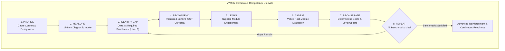
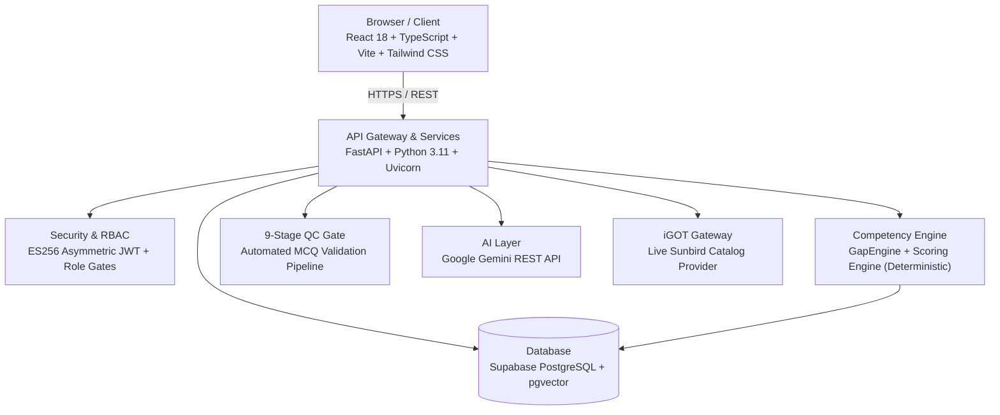

<div align="center">
    
# VYREN
### Competency Intelligence Platform
**Turn Skills Into Intelligence**

[](https://sih.gov.in)
[](https://mospi.gov.in)
[](https://nssta.gov.in)
[](https://karmayogibharat.gov.in)
[](#architecture)

<br/>

**Transforming Statistical Workforce Competencies Through Deterministic Measurement, Adaptive Learning, and Live iGOT Karmayogi Catalog Integration.**

[Overview](#overview) • [The Problem](#the-problem) • [Core Capabilities](#core-capabilities) • [Competency Model](#competency-model) • [MCQ Validation](#mcq-validation-pipeline) • [iGOT Integration](#igot--sunbird-integration) • [Architecture](#architecture) • [Getting Started](#getting-started)

</div>

---

## Overview

**VYREN** is an institutional Competency Intelligence Platform engineered for the **Official Statistical System (OSS)**, administered by the **Ministry of Statistics and Programme Implementation (MoSPI)** and aligned with the **National Statistical Systems Training Academy (NSSTA)** and the **Capacity Building Commission (CBC)** under **Mission Karmayogi** competency frameworks.

Unlike a conventional Learning Management System (LMS), VYREN operates as a closed-loop competency intelligence engine:

$$\text{PROFILE} \longrightarrow \text{MEASURE} \longrightarrow \text{IDENTIFY GAP} \longrightarrow \text{RECOMMEND} \longrightarrow \text{LEARN} \longrightarrow \text{ASSESS} \longrightarrow \text{RECALIBRATE} \longrightarrow \text{REPEAT}$$

### Key Distinction: Content Ecosystem vs Competency Intelligence

| Dimension | Learning Management System / Content Ecosystem (e.g., iGOT) | VYREN Competency Intelligence Layer |
| :--- | :--- | :--- |
| **Primary Focus** | Course hosting, content delivery, and enrollment management | Baseline competency measurement and empirical skill-gap detection |
| **Assessment Model** | Static completion badges or raw percentiles | Deterministic Level 0–4 proficiency scoring with Evidence Confidence |
| **Learning Path** | Catalog browsing and elective course enrollment | Priority-sequenced curriculum matched directly to measured skill deficits |
| **Post-Learning Impact** | Static course completion records | Dynamic score recalibration based on post-intervention evaluation evidence |
| **Workforce Governance** | Training hour accumulation metrics | Macro capability index, gap concentration heatmaps, and readiness audits |

---

## The Problem

Traditional civil-service training workflows often recommend or assign courses without establishing an empirical diagnostic baseline or verifying competency acquisition after training is complete. This disconnect leads to:

1. **Speculative Course Enrollment:** Personnel complete courses unrelated to their actual cadre requirements or operational capability deficits.
2. **Unverified Capability Growth:** Course completion is treated as proof of competence without post-learning evaluation or empirical evidence.
3. **Institutional Blind Spots:** Leadership lacks real-time workforce readiness visibility, relying on training-hour counts rather than verifiable capability telemetry.

VYREN resolves this challenge through an evidence-driven, deterministic competency loop that measures baseline capability, prescribes precise interventions, validates learning through rigorous assessment, and recalibrates measured scores in real time.

---

## Core Capabilities

### 1. Learner Workspace (Individual Competency Intelligence)
* **Cadre Onboarding:** Ingests officer designation, cadre wing (e.g., Indian Statistical Service, Subordinate Statistical Service), and departmental context.
* **Competency Framework Mapping:** Positions learner capabilities across 4 core domains and 40 structured competencies.
* **Diagnostic Assessment:** Delivers an initial 17-item evaluation to establish measured baseline performance.
* **Deterministic Level 0–4 Scoring:** Calculates reproducible proficiency levels grounded in empirical scoring rules rather than speculative estimates.
* **Evidence Confidence Telemetry:** Tracks empirical certainty (0.00–1.00) derived from item coverage and response consistency.
* **Skill-Gap Identification:** Quantifies deltas relative to required cadre benchmarks (Level 3 Proficient standard).
* **Explainable Recommendations:** Pairs identified skill gaps with prioritized modules from courses available through the live iGOT catalog with plain-language rationales.
* **Adaptive Learning Path:** Dynamically sequences active learning items, practical exercises, and post-module assessments.
* **Competency Recalibration:** Recalculates measured competency levels immediately upon assessment submission.
* **Grounded AI Assistant:** Conversational mentor grounded in the learner's active measured dossier, CBC standards, and assigned learning modules.

### 2. Trainer Workspace (Cohort Competency Intelligence)
* **AI-Assisted MCQ Generation:** Generates draft assessment items calibrated to discrete cognitive levels and statistical domains.
* **9-Stage Validation Pipeline:** Automatically tests candidate items against strict pedagogical and quality gates.
* **Human-in-the-Loop Governance:** Enables faculty to inspect, refine, approve, or reject candidate items before publication.
* **Item Bank Management:** Maintains an active repository of validated assessment items with difficulty parameters and competency taxonomy linkages.
* **Assessment Authoring:** Configures tailored assessment instruments with customizable time boundaries and item distribution.
* **Cohort Competency Analytics:** Visualizes cohort proficiency distribution across Level 0 to Level 4 bands with transparent intake denominators.
* **Pre/Post Training Tracking:** Tracks cohort capability evolution across evaluation cycles.

### 3. Administrator Workspace (Workforce Competency Intelligence)
* **Workforce Demographic Scope:** Aggregates total registered workforce, assessed sample size, and pending diagnostic intake counts.
* **Workforce Competency Landscape:** Visualizes cadre-wide capability distributions across core statistical and engineering domains.
* **Departmental Readiness Breakdown:** Disaggregates capability indices and assessment coverage across directorates and academies.
* **Training Program Coverage:** Evaluates active curricula, officer enrollment counts, and completion trajectories.
* **Live System & Gateway Telemetry:** Reports real-time latency for the PostgreSQL database, ES256 authentication status, and iGOT Sunbird endpoint reachability.
* **Workforce Matrix Export:** Generates one-click CSV audit exports of complete institutional competency profiles.

---

## Competency Model

VYREN measures competency across **4 core domains** comprising **40 structured competencies**:

1. **Statistical Inference & Sampling:** Survey design, stratified sampling, variance estimation, hypothesis testing, and econometric modeling.
2. **Data Pipeline Design & ETL:** Distributed ingestion, schema design, CDC pipelines, stream processing, and pipeline optimization.
3. **Machine Learning Operations (MLOps):** Model validation, drift monitoring, containerized inference, feature stores, and CI/CD pipelines.
4. **Data Governance & Compliance:** DPDP Act 2023 compliance, anonymization, metadata lineage, role-based access control, and public data ethics.

### Discrete Proficiency Scale (Levels 0–4)

$$\begin{array}{|c|c|l|}
\hline
\textbf{Level} & \textbf{Score Range} & \textbf{Proficiency Descriptor} \\
\hline
\text{Level 0} & 0\% - 24\% & \text{Foundational / Elementary awareness of definitions and survey structures} \\
\text{Level 1} & 25\% - 49\% & \text{Working / Procedural execution under supervisory guidance} \\
\text{Level 2} & 50\% - 69\% & \text{Autonomous / Independent practical application on official statistical datasets} \\
\text{Level 3} & 70\% - 84\% & \textbf{Proficient (Required Cadre Benchmark)} \text{ — Advanced problem-solving and pipeline design} \\
\text{Level 4} & 85\% - 100\% & \text{Master / Statistical system design, methodology authoring, and audit leadership} \\
\hline
\end{array}$$

### Measured Score vs Evidence Confidence

* **Measured Score (0 - 100):** Graded competency performance and mastery on evaluated items.
* **Evidence Confidence (0.00 - 1.00):** Evidence Confidence is an independent evidence-strength indicator derived from assessment coverage, item completion volume, and observational consistency; it is NOT a competency score itself. It reflects empirical coverage based on item discrimination parameters and response pattern stability.

---

## Adaptive Closed-Loop Architecture



Competency scores and proficiency levels update strictly from empirical assessment evidence, never from speculative estimates or arbitrary AI guesses.

---

## AI Architecture & Governance Boundaries

VYREN enforces a strict architectural separation between generative AI utilities and deterministic governance engines:

| System Layer | Implementation | Operational Responsibilities |
| :--- | :--- | :--- |
| **Generative AI Layer** | Google Gemini REST API via HTTPX | • Grounded conversational assistance using injected learner dossier context<br/>• Candidate MCQ generation based on statistical taxonomy<br/>• Content summarization and pedagogical explanation drafting<br/>• Semantic search assistance |
| **Deterministic Engine Layer** | Python / FastAPI Services (`GapEngine`, `ScoringEngine`) | • Assessment scoring and percentage score calculations<br/>• Discrete Level 0–4 proficiency classification<br/>• Skill gap quantification ($\Delta = \text{Required} - \text{Measured}$)<br/>• Execution of the 9-stage MCQ validation gate<br/>• Role-Based Access Control and authorization decisions |

> [!IMPORTANT]
> **Governance Principle:** Large Language Models (LLMs) never independently calculate, modify, or award competency scores. All proficiency ratings and gap values are computed deterministically.

---

## MCQ Validation Pipeline

All assessment candidates generated in the Trainer Studio pass through an automated **9-stage validation pipeline** before reaching faculty review:

```
Candidate MCQ ──► [1. Option Count (=4)]
               ──► [2. Option Distinctness]
               ──► [3. Answer Key Index (0-3)]
               ──► [4. Prompt Depth (≥25 chars)]
               ──► [5. Difficulty Alignment (Easy/Medium/Hard)]
               ──► [6. Pedagogical Rationale (≥15 chars)]
               ──► [7. Distractor Quality (No trivial giveaways)]
               ──► [8. Content Safety & Tone]
               ──► [9. Competency Framework Linkage] ──► Faculty Governance
```

* **AI Generates:** Proposes initial question draft, distractors, and pedagogical rationale.
* **VYREN Validates:** Executes deterministic 9-stage quality checks, rejecting malformed distractors or insufficient rationales.
* **Trainer Governs:** Faculty reviews validated candidates and authorizes publication to the active institutional item bank.

---

## iGOT / Sunbird Integration

VYREN interfaces with the **DoPT iGOT Karmayogi Sunbird API** (`https://igotkarmayogi.gov.in`) to anchor skill-gap remediation in connected public learning curricula:

* **Live Public Catalog Read & Semantic Search:** The platform connects to the live Sunbird search endpoint, enabling real-time discovery of courses available through the live iGOT catalog across basic statistics, sampling theory, and data governance.
* **Live Read Access Available:** Real-time search queries and course metadata ingestion operate natively against public catalog endpoints.
* **Writeback / Enrollment Credentials Not Configured in Demonstration Environment:** External write credentials (for direct automated enrollment push or credential writeback) are not configured in this demonstration environment.
* **Fallback Demonstration Catalog:** A curated fallback catalog is maintained to ensure uninterrupted evaluation if external network connectivity to Sunbird endpoints is unavailable.
* **Transparent Governance Boundary:** VYREN performs verified read-only catalog discovery and local enrollment simulation; it does not claim official government endorsement, formal external accreditation, or unauthorized external write operations.

---

## Technology Stack



* **Frontend:** React 18, TypeScript, Vite, Tailwind CSS, Lucide Icons, OGL WebGL canvas shaders.
* **Backend:** FastAPI, Python 3.11, Pydantic v2, HTTPX, PyJWT, Python-multipart.
* **Database & Storage:** Supabase PostgreSQL with Row-Level Security (RLS), pgvector for semantic retrieval, Supabase Storage.
* **AI & Machine Learning:** Google Gemini REST API via HTTPX with structured JSON output enforcement.
* **External Services:** Sunbird-compatible iGOT Karmayogi API (`https://igotkarmayogi.gov.in`).

---

## Security & Governance Controls

* **Asymmetric JWT Authentication:** User authentication tokens verified via cryptographic JWT standards with strict session lifecycle handling.
* **Server-Side Role-Based Access Control (RBAC):** Distinct permission tiers for `learner`, `trainer`, and `admin` roles, enforced at the API route level (HTTP 403 Forbidden on unauthorized access).
* **Admin Self-Registration Block:** Public self-registration of `admin` accounts is strictly blocked; administrative accounts must be provisioned internally.
* **IDOR Protection:** All learner assessment results, competency dossiers, and personalized pathways are scoped strictly to the authenticated user ID.
* **Environment Credential Segregation:** API keys, database credentials, and signing secrets are managed strictly through environment variables; zero credentials exist in source code.

---

## Demonstration Data & Denominators

All demonstration statistics are grounded in the **VYREN DEMONSTRATION COHORT**:

* **Registered Learners:** 4 accounts (Alex Vance, Sarthak Deshpande, Sarthakk, Audit System Tester).
* **Assessed Workforce:** 1 of 4 officers assessed (25% coverage).
* **Pending Assessment Intake:** 3 of 4 officers awaiting diagnostic evaluation (75%).
* **Assessed Cohort Mean Index:** 92.62% ($n = 1$, representing assessed officer Alex Vance).
* **Active Item Bank:** 17 validated assessment items linked to core competency domains.
* **Curricula Count:** 6 training programs with 1 recorded officer enrollment.

---

## Current Prototype Boundaries

1. **Demonstration Sample Scope:** The current demonstration population consists of a seed cohort designed for evaluation and hackathon validation.
2. **Read-Only iGOT Integration:** Course discovery interfaces with live Sunbird endpoints via read access; official write credentials for external state mutations are not configured.
3. **Single Sign-On (SSO):** Integration with institutional SSO providers (e.g., Parichay / MeriPehchaan) is designed into the architecture but operates via local JWT auth in this build.
4. **Predictive Analytics:** Macro predictive forecasting across multi-year cadre cohorts is architecturally mapped for scaled production deployment.

---

## Getting Started

### Prerequisites
* **Node.js** 18.x or higher
* **Python** 3.10 or 3.11
* **Git**

### 1. Clone the Repository
```bash
git clone https://github.com/TechStrikers-39/VYREN.git
cd VYREN
```

### 2. Backend Setup
```bash
cd backend
python -m venv .venv

# On Windows:
.venv\Scripts\activate
# On macOS/Linux:
source .venv/bin/activate

pip install -r requirements.txt

# Configure environment variables:
cp .env.example .env
# Edit .env with your Supabase URL, Anon Key, and Gemini API Key

uvicorn app.main:app --host 0.0.0.0 --port 8000 --reload
```

### 3. Frontend Setup
```bash
# In the repository root:
npm install

# Optional: configure frontend environment overrides:
cp .env.example .env

# Run development server:
npm run dev -- --port 3000

# Build for production:
npm run build
```

Open **`http://localhost:3000`** in your browser.

---

## Demonstration Roles

For local demonstration and evaluation, the following user roles are pre-configured in the demonstration database:

| Role | Primary Persona | Responsibilities in Demo |
| :--- | :--- | :--- |
| **Learner** | Assistant Director (ISS Cadre) | Context onboarding, diagnostic evaluation, adaptive pathway navigation, grounded AI assistance |
| **Trainer** | NSSTA Senior Faculty | MCQ generation, 9-stage validation gate inspection, cohort proficiency analytics |
| **Administrator** | System Administrator | Workforce capability landscape, departmental readiness monitoring, gateway telemetry, CSV export |

*Note: In accordance with security best practices, user credentials must be provisioned locally using your configured Supabase database instance.*

---

## Verification Suite

VYREN includes automated verification and regression suites covering all platform tiers:

```bash
# Verify Phase 5 Admin Workforce Intelligence:
backend\venv\Scripts\python.exe scratch\verify_phase5_admin_dashboard.py

# Verify Phase 4B Trainer Analytics:
backend\venv\Scripts\python.exe scratch\verify_phase4b_trainer_analytics.py

# Verify Production Workflow & 9-Stage Validation Gate:
backend\venv\Scripts\python.exe scratch\test_production_workflow_pass.py

# Verify Authentication, Onboarding & Server-Side RBAC:
backend\venv\Scripts\python.exe scratch\test_api_auth_and_onboarding_pass.py
```

---

## Roadmap

### Implemented & Verified (Demonstration Build)
- [x] Closed-loop competency intelligence lifecycle (Profile → Measure → Gap → Recommend → Learn → Assess → Recalibrate)
- [x] Deterministic Level 0–4 proficiency scoring with independent Evidence Confidence
- [x] Adaptive learning path with prioritized curriculum recommendations
- [x] Grounded Gemini AI competency assistant with active dossier injection
- [x] Automated 9-stage MCQ validation pipeline
- [x] Human-in-the-loop trainer authoring and item bank management
- [x] Cohort analytics with proficiency band distribution
- [x] Admin workforce competency landscape and departmental readiness tracking
- [x] Live Sunbird iGOT catalog search integration
- [x] CSV workforce competency matrix export and institutional audit trail

### Future Scope (Production Deployment)
- [ ] Official write credentials for automated iGOT course enrollment writeback
- [ ] Institutional Single Sign-On (SSO) integration via Parichay
- [ ] Scaled multi-cadre workforce rollout across state statistical bureaus
- [ ] Multi-year predictive competency decay and capability forecasting
- [ ] Automated question item calibration using empirical IRT response models

---

## Team TΣCH STRIKΣRS

Developed for **Smart India Hackathon 2026**.

*Built for India's Official Statistical System • Ministry of Statistics and Programme Implementation (MoSPI) • NSSTA • Mission Karmayogi*
